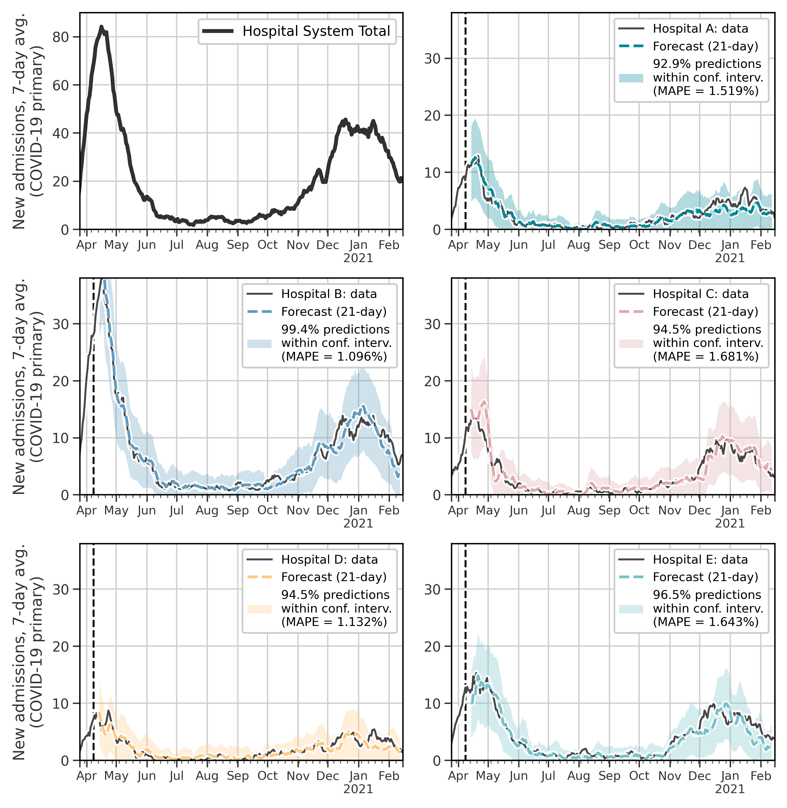

# Forecasting hospital-level COVID-19 admissions
[](https://zenodo.org/badge/latestdoi/580110094)

Replication materials for "Forecasting hospital-level COVID-19 admissions using real-time mobility data" (Klein et al., 2023)

- - - -

<p align="center">

</p>

**<p align="center">Forecasts for five major hospitals in a large hospital network in Massachusetts.**

- - - -

## Citation
If you use this data or would like to cite this work:

Bibtex: 
```text
@article{Klein2023forecast,
    title = {{Forecasting hospital-level COVID-19 admissions using real-time mobility data}},
    author = {Klein, Brennan and Zenteno, Ana Cecilia and Joseph, Daisha and Zahedi, Mohammadmehdi and Hu, Michael and Copenhaver, Martin S. and Kraemer, Moritz U.G. and Chinazzi, Matteo and Klompas, Michael and Vespignani, Alessandro and Scarpino, Samuel V. and Salmasian, Hojjat},
    journal = {Communications Medicine},
    year = {2023},
}
```
